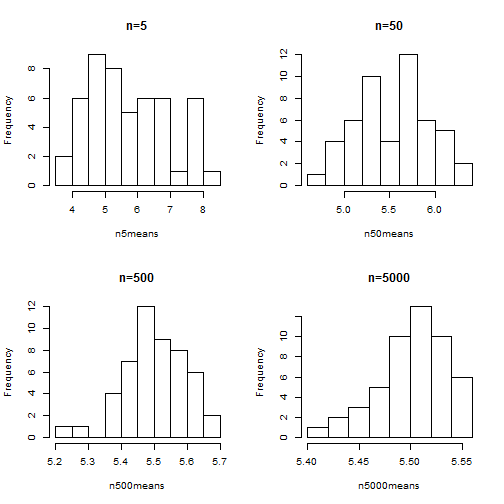

----------------------

1. Using __ruinf__  function to generate some random uniform distribution and storing all distributions in a list::


```r
myList <- list(matrix(runif(50*5,min=1,max=10),nrow=50), 
            + matrix(runif(50*50,min=1,max=10),nrow=50), 
           + matrix(runif(50*500,min=1,max=10),nrow=50), 
          + matrix(runif(50*5000,min=1,max=10),nrow=50))
```


2. Calculating the mean value of each row of each element of list(myList):

```r
n5means<-apply(myList[[1]],1,mean)
n50means<-apply(myList[[2]],1,mean)
n500means<-apply(myList[[3]],1,mean)
n5000means<-apply(myList[[4]],1,mean)
```

3. Dividing the graph output in 4 figures, and then using __hist()__ function to generate related histograms, and As a final point, we will plot the calculated means :

```r
par(mfrow = c(2,2))
hist(n5means,main="n=5")
hist(n50means,main="n=50",nclass=10)
hist(n500means,main="n=500",nclass=10)
hist(n5000means,main="n=5000",nclass=10)
```



__Base on histograms plotted above, as the number of instances increases; normal distribution is more reflected in plots.__

------

